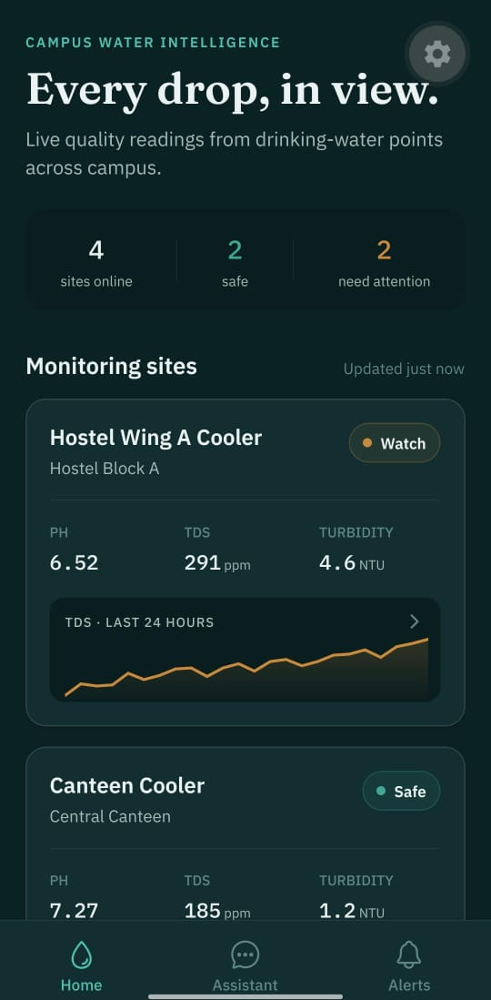
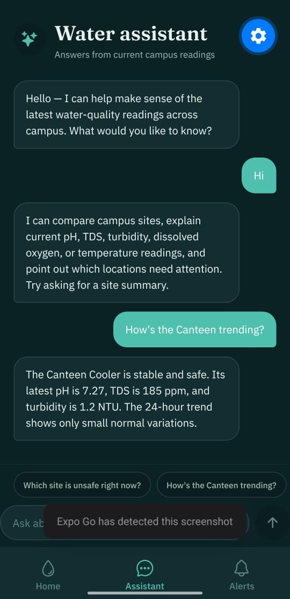
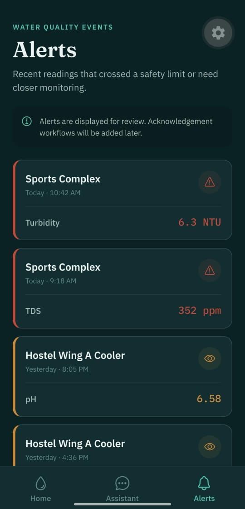
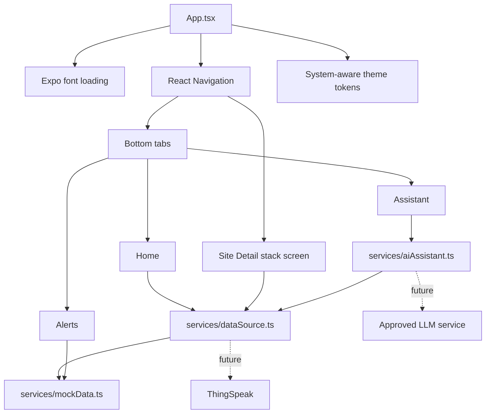

<p align="center">
  
</p>

<h1 align="center">WellSpring</h1>

<p align="center">
  <strong>Campus water intelligence, made calm and understandable.</strong><br />
  A native Android app for monitoring drinking-water quality across campus.
</p>

<p align="center">
  
  
  
  
</p>

---

## See every drop clearly

WellSpring turns sensor readings into a focused mobile experience for students, staff, and campus operations teams. It brings site status, five essential water-quality parameters, 24-hour trends, alerts, and plain-English guidance into one native Android application.

> [!NOTE]
> The current build uses deterministic mock sensor data. ThingSpeak and real LLM integrations are intentionally isolated behind service boundaries and are not active yet.

## App preview

<table>
  <tr>
    <td align="center"><strong>Campus overview</strong></td>
    <td align="center"><strong>Water assistant</strong></td>
    <td align="center"><strong>Quality alerts</strong></td>
  </tr>
  <tr>
    <td></td>
    <td></td>
    <td></td>
  </tr>
  <tr>
    <td align="center">Live-style site cards, status counts, readings, and TDS trends</td>
    <td align="center">Plain-English answers grounded in current campus readings</td>
    <td align="center">Watch and unsafe events with severity-first presentation</td>
  </tr>
</table>

## What it does

- **Campus-wide overview** — scan every monitored drinking-water point from one calm dashboard.
- **Status at a glance** — distinguish Safe, Watch, and Unsafe locations immediately.
- **Five sensor parameters** — inspect pH, TDS, turbidity, dissolved oxygen, and temperature.
- **24-hour trends** — read SVG charts with a shaded safe-range band and status-colored line.
- **Recent-reading table** — compare six samples across all five parameters.
- **Water assistant** — ask common questions through a provider-independent assistant service.
- **Actionable alerts** — review readings that crossed or approached safety limits.
- **Responsive themes** — follow the Android system light/dark appearance across phone sizes.

## How the app is organized



### Data flow

```text
Mock sensor generator
        │
        ▼
services/dataSource.ts
        │
        ├── getSites()
        └── getSiteHistory(siteId, parameter)
                 │
                 ▼
         Screens and charts
```

The UI never needs to know whether readings came from the mock generator or a future provider. The live-data switch is intentionally concentrated in `services/dataSource.ts`.

## Technology

| Area | Choice |
|---|---|
| Mobile runtime | Expo SDK 57 + React Native 0.86 |
| Language | TypeScript with strict mode |
| Navigation | Bottom tabs + native stack |
| Charts | Hand-built `react-native-svg` charts |
| Display font | Fraunces |
| UI font | IBM Plex Sans |
| Reading font | IBM Plex Mono |
| Theme | System-aware light and dark palettes |
| Current data | Deterministic local mock generator |

## Project structure

```text
WellSpring/
├── App.tsx                    # font loading and navigation shell
├── components/                # charts, site cards, status badges
├── screens/                   # Home, Site Detail, Assistant, Alerts
├── services/
│   ├── dataSource.ts          # provider boundary
│   ├── mockData.ts            # sites, histories, parameters, alerts
│   └── aiAssistant.ts         # assistant boundary
├── theme/tokens.ts            # palettes, fonts, spacing, status colors
├── types.ts                   # shared domain and navigation types
├── docs/
│   ├── assets/                # repository artwork
│   └── screenshots/           # authentic app captures
└── ai/                        # architecture and maintenance documentation
```

## Run it on Android

### Prerequisites

- Node.js and npm
- [Expo Go](https://expo.dev/go) on an Android device, or an Android emulator
- Your computer and device on the same local network when using Expo Go

### Start the app

```bash
git clone https://github.com/Raghav7-tech/WellSpring.git
cd WellSpring
npm install
npx expo start
```

Scan the displayed QR code with Expo Go. If an Android emulator is already running, press `a` in the Expo terminal.

### Available commands

| Command | Purpose |
|---|---|
| `npm start` | Start the Expo development server |
| `npm run android` | Start Expo and target Android |
| `npm run typecheck` | Run strict TypeScript validation |

## Mock sites

| Site | Campus location | Demonstration status |
|---|---|---|
| Hostel Wing A Cooler | Hostel Block A | Watch |
| Canteen Cooler | Central Canteen | Safe |
| Sports Complex | Sports & Gym Block | Unsafe |
| Admin Building | Administrative Block · Lobby | Safe |

Every site has 24 generated hourly readings per parameter. The mock generator adds deterministic noise and slow drift so charts remain realistic and repeatable during development.

## Integration boundaries

### ThingSpeak

All site/history access goes through `services/dataSource.ts`. The file contains empty channel/key placeholders and a commented feed request for the future hardware integration. No real ThingSpeak request or credential is currently active.

### Assistant provider

The chat screen calls one function: `getAnswer(question)`. Its current implementation uses local keyword matching and can later be replaced behind the same boundary.

> [!IMPORTANT]
> Never place a real LLM secret directly in the mobile bundle. A production AI integration needs an approved secure server-side design.

## Roadmap

- [x] Responsive native Android interface
- [x] System light and dark themes
- [x] Four-site monitoring overview
- [x] Five-parameter trend charts
- [x] Mock assistant and suggested questions
- [x] Severity-based alert list
- [ ] Live ThingSpeak channel integration
- [ ] Secure production assistant integration
- [ ] Live timestamps, stale-data handling, and retry strategy
- [ ] Automated tests and CI checks
- [ ] EAS build profiles and Play Store release workflow

## Project documentation

| Document | Purpose |
|---|---|
| [`start.md`](start.md) | Product scope, visual system, architecture, and acceptance criteria |
| [`ai/current-state.md`](ai/current-state.md) | Factual implementation snapshot |
| [`ai/decisions.md`](ai/decisions.md) | Evidence-based technical decision record |
| [`ai/known-issues.md`](ai/known-issues.md) | Current risks, limitations, and next investigations |
| [`ai/instructions.md`](ai/instructions.md) | Guardrails for future AI-assisted work |

## Contributing safely

1. Keep the project Android-only and Expo-managed.
2. Preserve the service boundaries for sensor data and assistant responses.
3. Do not commit `.env` files, API keys, tokens, keystores, or credentials.
4. Run `npm run typecheck` before committing.
5. Verify important UI changes in Expo Go on Android in both light and dark mode.
6. Use focused, human-readable commits.

---

<p align="center">
  Built for calmer, faster decisions about campus drinking water.
</p>
